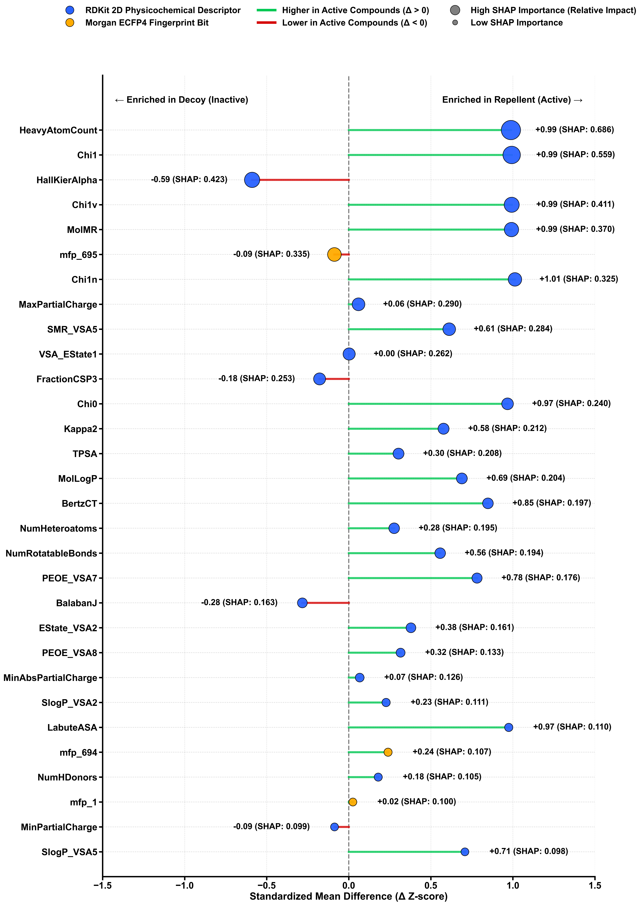
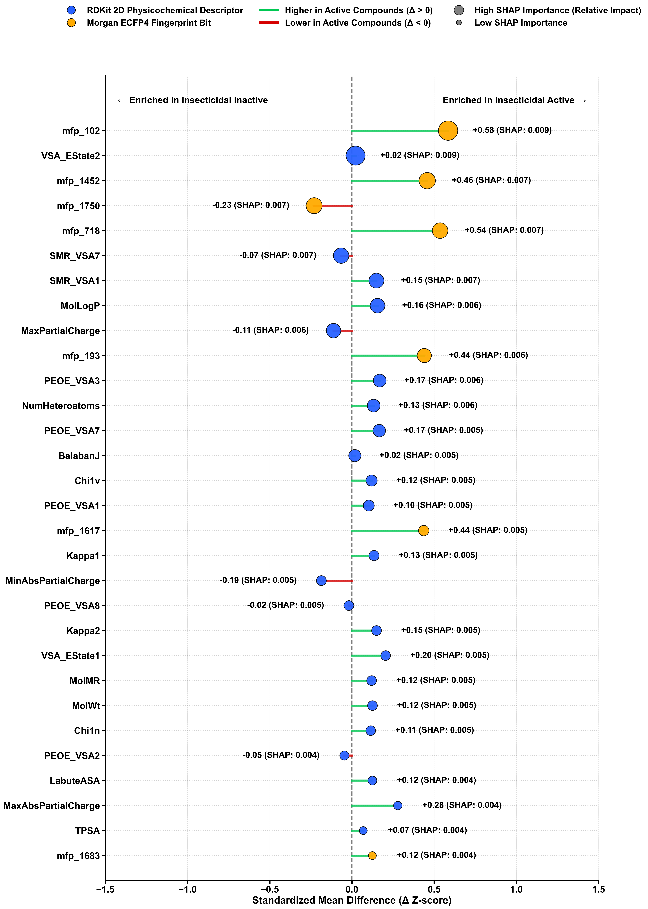
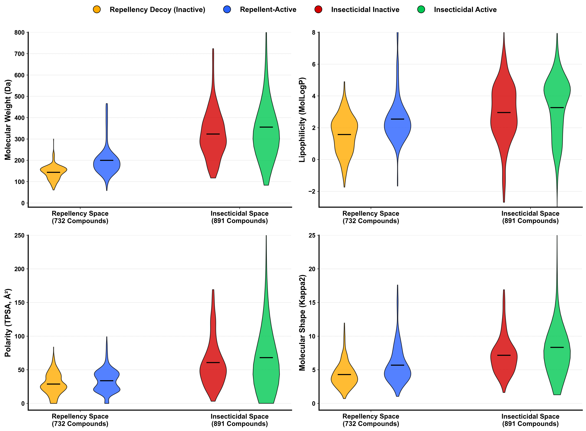

# Supplementary Material

## ECOAI: AI-Driven Discovery of Eco-Friendly Insect Repellent Compounds

---

## Table S1. Top 30 SHAP Features — Repellency Model (XGBoost)

Mean absolute SHAP values from TreeExplainer applied to the winning XGBoost repellency classifier. Of the top 30 features, **27 are RDKit 2D physicochemical descriptors** and **3 are Morgan fingerprint (ECFP4) structural bits**.

### Figure S1: SHAP-Weighted Diverging Lollipop Plot — Repellency Model

**Figure Caption**: Top 30 features ranked by mean absolute SHAP importance. Marker area represents absolute SHAP importance (exact value in parentheses). Marker color represents descriptor class: RDKit 2D physical descriptors (🔵) vs. Morgan fingerprint bits (🟡). Horizontal position represents the Standardized Mean Difference (\Delta Z-score) computed globally over the labeled dataset. Green stems extending rightward denote positive enrichment in repellent-active compounds (\Delta > 0), while red stems extending leftward denote negative enrichment (\Delta < 0).

### Table S1 Data Averages

| Rank | Feature | Type | Mean \|SHAP\| | Rep. Mean | Non-Rep. Mean | Δ |
|------|---------|------|-------------|-----------|---------------|---|
| 1 | HeavyAtomCount | RDKit 2D | 0.6862 | 14.1394 | 9.8106 | +4.3288 |
| 2 | Chi1 | RDKit 2D | 0.5592 | 6.7419 | 4.6435 | +2.0983 |
| 3 | HallKierAlpha | RDKit 2D | 0.4233 | -0.9638 | -0.6263 | -0.3375 |
| 4 | Chi1v | RDKit 2D | 0.4112 | 5.2469 | 3.5371 | +1.7098 |
| 5 | MolMR | RDKit 2D | 0.3698 | 57.1241 | 39.2792 | +17.8449 |
| 6 | mfp_695 | Morgan FP Bit | 0.3353 | 0.4772 | 0.5209 | -0.0437 |
| 7 | Chi1n | RDKit 2D | 0.3253 | 5.1992 | 3.4450 | +1.7542 |
| 8 | MaxPartialCharge | RDKit 2D | 0.2895 | 0.2010 | 0.1940 | +0.0071 |
| 9 | SMR_VSA5 | RDKit 2D | 0.2840 | 36.5375 | 24.0956 | +12.4419 |
| 10 | VSA_EState1 | RDKit 2D | 0.2621 | 3.8665 | 3.8565 | +0.0100 |
| 11 | FractionCSP3 | RDKit 2D | 0.2534 | 0.6139 | 0.6647 | -0.0507 |
| 12 | Chi0 | RDKit 2D | 0.2403 | 10.6234 | 7.5723 | +3.0511 |
| 13 | Kappa2 | RDKit 2D | 0.2117 | 5.6890 | 4.2789 | +1.4101 |
| 14 | TPSA | RDKit 2D | 0.2075 | 33.7125 | 28.7638 | +4.9487 |
| 15 | MolLogP | RDKit 2D | 0.2037 | 2.5431 | 1.5685 | +0.9746 |
| 16 | BertzCT | RDKit 2D | 0.1970 | 262.5225 | 137.0279 | +125.4946 |
| 17 | NumHeteroatoms | RDKit 2D | 0.1953 | 2.4799 | 2.1421 | +0.3378 |
| 18 | NumRotatableBonds | RDKit 2D | 0.1943 | 4.2306 | 2.7242 | +1.5063 |
| 19 | PEOE_VSA7 | RDKit 2D | 0.1764 | 26.2091 | 14.7438 | +11.4653 |
| 20 | BalabanJ | RDKit 2D | 0.1635 | 2.7689 | 2.9424 | -0.1735 |
| 21 | EState_VSA2 | RDKit 2D | 0.1611 | 8.8760 | 6.0406 | +2.8355 |
| 22 | PEOE_VSA8 | RDKit 2D | 0.1328 | 7.2904 | 5.2858 | +2.0046 |
| 23 | MinAbsPartialCharge | RDKit 2D | 0.1258 | 0.2023 | 0.1946 | +0.0076 |
| 24 | SlogP_VSA2 | RDKit 2D | 0.1112 | 17.3180 | 15.0049 | +2.3130 |
| 25 | LabuteASA | RDKit 2D | 0.1101 | 86.6363 | 61.0575 | +25.5788 |
| 26 | mfp_694 | Morgan FP Bit | 0.1066 | 0.2493 | 0.1532 | +0.0961 |
| 27 | NumHDonors | RDKit 2D | 0.1047 | 0.5094 | 0.3900 | +0.1194 |
| 28 | mfp_1 | Morgan FP Bit | 0.1002 | 0.2869 | 0.2758 | +0.0111 |
| 29 | MinPartialCharge | RDKit 2D | 0.0990 | -0.3966 | -0.3876 | -0.0090 |
| 30 | SlogP_VSA5 | RDKit 2D | 0.0978 | 35.7153 | 22.2270 | +13.4882 |

## Table S2. Top 30 SHAP Features — Insecticidal Model (RandomForest)

Mean absolute SHAP values from TreeExplainer applied to the winning RandomForest insecticidal classifier trained on 891 ChEMBL-derived compounds.

### Figure S2: SHAP-Weighted Diverging Lollipop Plot — Insecticidal Model

**Figure Caption**: Top 30 features ranked by mean absolute SHAP importance. Marker area represents absolute SHAP importance (exact value in parentheses). Marker color represents descriptor class: RDKit 2D physical descriptors (🔵) vs. Morgan fingerprint bits (🟡). Horizontal position represents the Standardized Mean Difference (\Delta Z-score) computed globally over the insecticidal dataset. Green stems extending rightward denote positive enrichment in active insecticidal compounds (\Delta > 0), while red stems extending leftward denote negative enrichment (\Delta < 0).

### Table S2 Data Averages

| Rank | Feature | Type | Mean \|SHAP\| | Active Mean | Inactive Mean | Δ |
|------|---------|------|-------------|-------------|---------------|---|
| 1 | mfp_102 | Morgan FP Bit | 0.0089 | 0.2915 | 0.0505 | +0.2410 |
| 2 | VSA_EState2 | RDKit 2D | 0.0087 | 17.5962 | 16.7320 | +0.8642 |
| 3 | mfp_1452 | Morgan FP Bit | 0.0072 | 0.4169 | 0.1986 | +0.2184 |
| 4 | mfp_1750 | Morgan FP Bit | 0.0070 | 0.7280 | 0.8267 | -0.0987 |
| 5 | mfp_718 | Morgan FP Bit | 0.0069 | 0.2752 | 0.0578 | +0.2175 |
| 6 | SMR_VSA7 | RDKit 2D | 0.0068 | 45.6985 | 47.6612 | -1.9627 |
| 7 | SMR_VSA1 | RDKit 2D | 0.0065 | 14.8179 | 12.3010 | +2.5169 |
| 8 | MolLogP | RDKit 2D | 0.0064 | 3.2665 | 2.9521 | +0.3144 |
| 9 | MaxPartialCharge | RDKit 2D | 0.0063 | 0.2533 | 0.2651 | -0.0118 |
| 10 | mfp_193 | Morgan FP Bit | 0.0062 | 0.1221 | 0.0000 | +0.1221 |
| 11 | PEOE_VSA3 | RDKit 2D | 0.0056 | 4.9088 | 3.8588 | +1.0500 |
| 12 | NumHeteroatoms | RDKit 2D | 0.0056 | 6.6303 | 5.7112 | +0.9191 |
| 13 | PEOE_VSA7 | RDKit 2D | 0.0055 | 39.8368 | 35.2779 | +4.5589 |
| 14 | BalabanJ | RDKit 2D | 0.0054 | 2.1709 | 2.1610 | +0.0098 |
| 15 | Chi1v | RDKit 2D | 0.0050 | 8.7029 | 7.9290 | +0.7738 |
| 16 | PEOE_VSA1 | RDKit 2D | 0.0049 | 11.9345 | 9.9308 | +2.0037 |
| 17 | mfp_1617 | Morgan FP Bit | 0.0048 | 0.1205 | 0.0000 | +0.1205 |
| 18 | Kappa1 | RDKit 2D | 0.0047 | 18.3432 | 16.3087 | +2.0346 |
| 19 | MinAbsPartialCharge | RDKit 2D | 0.0046 | 0.2391 | 0.2559 | -0.0167 |
| 20 | PEOE_VSA8 | RDKit 2D | 0.0045 | 15.8874 | 16.1764 | -0.2890 |
| 21 | Kappa2 | RDKit 2D | 0.0045 | 8.3328 | 7.1494 | +1.1834 |
| 22 | VSA_EState1 | RDKit 2D | 0.0045 | 14.2626 | 10.8003 | +3.4623 |
| 23 | MolMR | RDKit 2D | 0.0045 | 94.2725 | 86.2564 | +8.0161 |
| 24 | MolWt | RDKit 2D | 0.0045 | 355.4611 | 322.7560 | +32.7051 |
| 25 | Chi1n | RDKit 2D | 0.0045 | 8.0305 | 7.3377 | +0.6928 |
| 26 | PEOE_VSA2 | RDKit 2D | 0.0044 | 6.3823 | 7.0164 | -0.6341 |
| 27 | LabuteASA | RDKit 2D | 0.0043 | 146.6624 | 133.4631 | +13.1992 |
| 28 | MaxAbsPartialCharge | RDKit 2D | 0.0042 | 0.4147 | 0.3924 | +0.0223 |
| 29 | TPSA | RDKit 2D | 0.0040 | 68.0218 | 60.7372 | +7.2846 |
| 30 | mfp_1683 | Morgan FP Bit | 0.0040 | 0.3013 | 0.2455 | +0.0558 |

## Tables S3–S5. Full Compound Lists

Complete compound-level data is provided as CSV files in the `tables/` directory:

| Table | File | Records | Description |
|-------|------|---------|-------------|
| S3 | `Table_S3_repellent_compounds.csv` | 373 | Repellent-active compounds (*Aedes aegypti*) with calibrated probabilities |
| S4 | `Table_S4_decoy_compounds.csv` | 359 | Non-repellent (decoy/negative control) compounds |
| S5 | `Table_S5_insecticidal_compounds.csv` | 891 | ChEMBL-derived insecticidal compounds with bioactivity metadata |
| S6 | `Table_S6_dual_screening_results.csv` | 2880 | Dual virtual screening predictions (repellency + toxicity) |

### Figure S3: Physicochemical Property Space Distributions — Size, Lipophilicity, Polarity, and Shape

**Figure Caption**: Distribution of key drug-like physicochemical properties across the repellency (n = 732) and insecticidal (n = 891) datasets. Split violin plots compare the distributions of Molecular Weight (size), MolLogP (lipophilicity), Topological Polar Surface Area (polarity), and Kappa2 (flexibility/shape) between active (🔵, 🟢) and inactive/decoy (🟡, 🔴) compounds. Black horizontal lines denote sample means (exact numeric values are listed in Table S7 for repellency, and in Table S8 for insecticidal descriptors).

## Table S7. Summary Statistics of the Labeled Repellency Dataset

| Property | Repellent (n=373) | Non-Repellent (n=359) | Overall (n=732) |
|----------|---------------------------|-------------------------------|--------------------------|
| Molecular Weight (Da) | 199.2928 ± 68.8872 | 143.4622 ± 31.8422 | 171.9114 ± 60.7579 |
| HeavyAtomCount | 14.1394 ± 4.9943 | 9.8106 ± 1.9297 | 12.0164 ± 4.3825 |
| Chi1 | 6.7419 ± 2.3968 | 4.6435 ± 0.9504 | 5.7128 ± 2.1137 |
| HallKierAlpha | -0.9638 ± 0.6392 | -0.6263 ± 0.4329 | -0.7983 ± 0.5729 |
| Chi1v | 5.2469 ± 1.9000 | 3.5371 ± 0.9027 | 4.4083 ± 1.7227 |
| MolMR | 57.1241 ± 20.1406 | 39.2792 ± 8.8125 | 48.3723 ± 18.0042 |
| Chi1n | 5.1992 ± 1.9083 | 3.4450 ± 0.8795 | 4.3388 ± 1.7327 |
| MaxPartialCharge | 0.2010 ± 0.1187 | 0.1940 ± 0.1200 | 0.1976 ± 0.1193 |
| SMR_VSA5 | 36.5375 ± 22.3053 | 24.0956 ± 15.7559 | 30.4355 ± 20.3348 |
| VSA_EState1 | 3.8665 ± 5.1886 | 3.8565 ± 3.9768 | 3.8616 ± 4.6309 |
| FractionCSP3 | 0.6139 ± 0.2815 | 0.6647 ± 0.2880 | 0.6388 ± 0.2856 |
| Chi0 | 10.6234 ± 3.6155 | 7.5723 ± 1.4046 | 9.1270 ± 3.1540 |
| Kappa2 | 5.6890 ± 2.7351 | 4.2789 ± 1.8382 | 4.9975 ± 2.4412 |
| TPSA | 33.7125 ± 16.6691 | 28.7638 ± 15.6212 | 31.2855 ± 16.3412 |
| MolLogP | 2.5431 ± 1.4650 | 1.5685 ± 1.1691 | 2.0651 ± 1.4139 |
| BertzCT | 262.5225 ± 174.3903 | 137.0279 ± 71.3916 | 200.9753 ± 148.0327 |
| NumHeteroatoms | 2.4799 ± 1.3331 | 2.1421 ± 1.0725 | 2.3142 ± 1.2232 |
| NumRotatableBonds | 4.2306 ± 3.1127 | 2.7242 ± 1.9243 | 3.4918 ± 2.7040 |
| PEOE_VSA7 | 26.2091 ± 16.3516 | 14.7438 ± 9.7472 | 20.5861 ± 14.6796 |
| BalabanJ | 2.7689 ± 0.6675 | 2.9424 ± 0.5376 | 2.8540 ± 0.6130 |
| EState_VSA2 | 8.8760 ± 8.7023 | 6.0406 ± 5.6368 | 7.4854 ± 7.4907 |
| PEOE_VSA8 | 7.2904 ± 7.2361 | 5.2858 ± 5.0795 | 6.3072 ± 6.3472 |
| MinAbsPartialCharge | 0.2023 ± 0.1149 | 0.1946 ± 0.1153 | 0.1985 ± 0.1151 |
| SlogP_VSA2 | 17.3180 ± 10.3657 | 15.0049 ± 9.8711 | 16.1836 ± 10.1852 |
| LabuteASA | 86.6363 ± 29.7924 | 61.0575 ± 12.2722 | 74.0915 ± 26.2522 |
| NumHDonors | 0.5094 ± 0.6745 | 0.3900 ± 0.6503 | 0.4508 ± 0.6650 |
| MinPartialCharge | -0.3966 ± 0.0968 | -0.3876 ± 0.1095 | -0.3921 ± 0.1033 |
| SlogP_VSA5 | 35.7153 ± 20.4911 | 22.2270 ± 14.5820 | 29.1001 ± 19.0615 |

## Table S8. Summary Statistics of the Labeled Insecticidal Dataset

| Property | Insecticidal Active (n=614) | Insecticidal Inactive (n=277) | Overall (n=891) |
|----------|---------------------------|-------------------------------|--------------------------|
| Molecular Weight (Da) | 355.4611 ± 306.5069 | 322.7560 ± 110.1287 | 345.2936 ± 262.1021 |
| VSA_EState2 | 17.5962 ± 46.9916 | 16.7320 ± 11.8646 | 17.3275 ± 39.5569 |
| SMR_VSA7 | 45.6985 ± 29.4767 | 47.6612 ± 30.2588 | 46.3087 ± 29.7190 |
| SMR_VSA1 | 14.8179 ± 19.3967 | 12.3010 ± 9.2629 | 14.0354 ± 16.9440 |
| MolLogP | 3.2665 ± 2.1065 | 2.9521 ± 1.8142 | 3.1688 ± 2.0244 |
| MaxPartialCharge | 0.2533 ± 0.1066 | 0.2651 ± 0.0998 | 0.2569 ± 0.1046 |
| PEOE_VSA3 | 4.9088 ± 6.7191 | 3.8588 ± 4.9001 | 4.5823 ± 6.2271 |
| NumHeteroatoms | 6.6303 ± 8.1330 | 5.7112 ± 2.9371 | 6.3446 ± 6.9581 |
| PEOE_VSA7 | 39.8368 ± 29.8964 | 35.2779 ± 20.6858 | 38.4195 ± 27.4366 |
| BalabanJ | 2.1709 ± 0.5954 | 2.1610 ± 0.5169 | 2.1678 ± 0.5719 |
| Chi1v | 8.7029 ± 7.5931 | 7.9290 ± 2.7111 | 8.4623 ± 6.4899 |
| PEOE_VSA1 | 11.9345 ± 23.0579 | 9.9308 ± 7.5725 | 11.3115 ± 19.6172 |
| Kappa1 | 18.3432 ± 17.8331 | 16.3087 ± 5.7184 | 17.7107 ± 15.1680 |
| MinAbsPartialCharge | 0.2391 ± 0.0894 | 0.2559 ± 0.0888 | 0.2443 ± 0.0895 |
| PEOE_VSA8 | 15.8874 ± 16.2818 | 16.1764 ± 12.4815 | 15.9772 ± 15.1960 |
| Kappa2 | 8.3328 ± 9.3356 | 7.1494 ± 2.7637 | 7.9649 ± 7.9182 |
| VSA_EState1 | 14.2626 ± 17.7281 | 10.8003 ± 14.6500 | 13.1863 ± 16.8996 |
| MolMR | 94.2725 ± 78.5991 | 86.2564 ± 28.1219 | 91.7804 ± 67.1870 |
| MolWt | 355.4611 ± 306.5069 | 322.7560 ± 110.1287 | 345.2936 ± 262.1021 |
| Chi1n | 8.0305 ± 7.1035 | 7.3377 ± 2.6398 | 7.8151 ± 6.0843 |
| PEOE_VSA2 | 6.3823 ± 15.9793 | 7.0164 ± 5.8537 | 6.5794 ± 13.6594 |
| LabuteASA | 146.6624 ± 124.3083 | 133.4631 ± 44.1751 | 142.5589 ± 106.2341 |
| MaxAbsPartialCharge | 0.4147 ± 0.0789 | 0.3924 ± 0.0786 | 0.4078 ± 0.0795 |
| TPSA | 68.0218 ± 125.2518 | 60.7372 ± 34.9127 | 65.7571 ± 105.8051 |

## Table S6a. Holy Grail Compounds — Safe Repellents

Three compounds from the LifeChemicals screening library (n = 2,880) classified as highly repellent yet non-insecticidal.

| Compound ID | p_repellent | p_insecticidal | SMILES |
|-------------|-------------|----------------|--------|
| LIC_00005 | 0.6471 | 0.1250 | `c1cncc(CN2CCCC2)c1` |
| LIC_00280 | 1.0000 | 0.1250 | `O=C(O)CCc1nc(-c2ccccc2)no1` |
| LIC_00386 | 1.0000 | 0.1250 | `COc1ccc(-c2noc(CCC(=O)O)n2)cc1` |

## Dual Virtual Screening Category Summary

| Category | Count |
|----------|-------|
| Toxic Repellent | 2835 |
| Bug Spray (Toxic) | 36 |
| Inactive | 6 |
| Holy Grail (Safe Repellent) | 3 |

---

*Generated programmatically from ECOAI pipeline data by `generate_supplementary.py`.*
